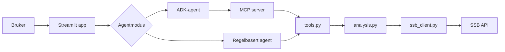
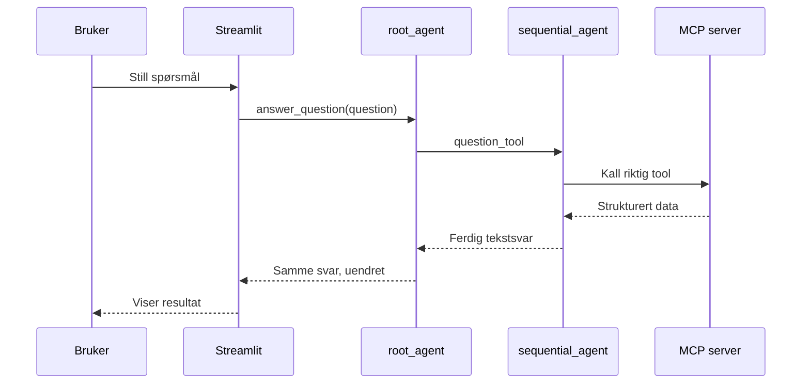

# SSB Byggeagent

Dette prosjektet er et beslutningsstøtteverktøy for boligutbygging i norske kommuner. Løsningen henter åpne data fra SSB, beregner en enkel score, og svarer på spørsmål i et Streamlit-grensesnitt.

## Hva systemet gjør

Systemet bruker to SSB-tabeller:

- `07459`: befolkningsdata
- `13021`: byggesak og saksbehandlingstid

Spørsmål fra bruker blir besvart i én av to moduser:

- `Tokenfri regelbasert agent` (standard): rask, billig, uten LLM-kall
- `Google ADK / Gemini-agent` (valgfri): bruker MCP-tools og formulerer svar med LLM

Analysen er den samme i begge moduser. Forskjellen er hvordan svaret blir presentert.

## Systemdiagrammer

### 1) Komponentdiagram



### 2) Flyt for ADK-modus



## Hvorfor dette agentsystemet og hvorfor MCP

### Valg av agentsystem

Vi bruker to agentbaner fordi behovene er ulike:

- Regelbasert agent passer når vi vil ha stabilt og forklarbart resultat uten API-kostnad.
- ADK-agent passer når vi vil ha mer naturlig språk og fleksibel spørsmålstolkning.

ADK-løpet er satt opp som en enkel sekvens (`input -> retrieval -> presenting`) slik at det er lett å følge i demo og lett å feilsøke.

### Valg av MCP-server

MCP-laget gjør analysefunksjonene tilgjengelige som verktøy over HTTP (`/mcp`). Det gir tre fordeler:

- Samme funksjoner kan brukes av både ADK-agent og eksterne klienter.
- Tydelig skille mellom presentasjon (app), orkestrering (agent) og domene-/analysekode.
- Enklere testing: man kan kjøre og teste tools uten å starte hele appen.

## Hvordan løsningen brukes

1. Start MCP-serveren.
2. Start Streamlit-appen.
3. Velg agentmodus i UI.
4. Still spørsmål i tekstfeltet og trykk `Analyser`.

Typiske spørsmål:

- `Hvilken kommune er best?`
- `Sammenlign Oslo og Bærum`
- `Vurder Lillestrøm`

## Eksempel på brukerspørring og resultat

Eksempel fra faktisk kjøring av regelbasert agent:

**Spørring**

```text
Hvilken kommune er best?
```

**Resultat**

```text
## Beste kandidat

**Lørenskog**
- Total score: 98.07
- Befolkningsvekst: 7273.0 (17.02 %)
- Saksbehandlingstid: 27.0
- Vurdering: Sterk kandidat
```

Resultatet over vil kunne variere over tid når SSB-data oppdateres.

## For utviklere: last ned, sett opp og kjør

### 1) Klon og gå inn i prosjektet

```bash
git clone <https://github.com/kRcC/ssb_build_agent_adk>
cd ssb_build_agent_adk
```

### 2) Opprett virtuelt miljø

Windows PowerShell:

```powershell
python -m venv .venv
.\.venv\Scripts\Activate.ps1
```

macOS/Linux:

```bash
python -m venv .venv
source .venv/bin/activate
```

### 3) Installer avhengigheter

```bash
pip install -r requirements.txt
```

### 4) (Valgfritt) sett opp `.env` for ADK-modus

Hvis du kun skal bruke regelbasert modus, kan du hoppe over dette.

```text
GOOGLE_API_KEY=din_nokkel
GOOGLE_ADK_MODEL=gemini-2.5-flash
MCP_URL=http://127.0.0.1:8000/mcp
```

### 5) Start MCP-server

```bash
python -m mcp_server.server
```

Serveren kjører på:

```text
http://127.0.0.1:8000/mcp
```

### 6) Start appen i en ny terminal

```bash
streamlit run app.py
```

### 7) (Valgfritt) test tools direkte med klient

```bash
python mcp_client.py healthcheck
python mcp_client.py rank
python mcp_client.py best
```

## Prosjektstruktur (kort)

- `app.py`: Streamlit UI
- `src/rule_agent.py`: tokenfri agentlogikk
- `src/agent.py`: ADK-agent med MCP-toolkall
- `src/analysis.py`: analyse og scoreberegning
- `src/tools.py`: samlet verktøylag
- `mcp_server/server.py`: MCP-server og tool-eksponering
- `mcp_client.py`: enkel CLI-klient for testing
