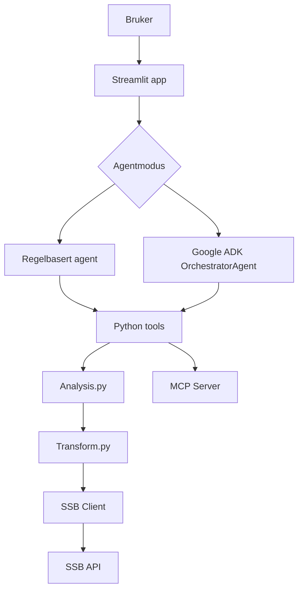

# Arkitektur

## Agentroller

- OrchestratorAgent: velger arbeidsflyt og svarformat.
- DataAgent: representert av SSB tools.
- AnalysisAgent: representert av analysefunksjoner.
- ReportAgent: ADK-agenten formulerer svaret.
